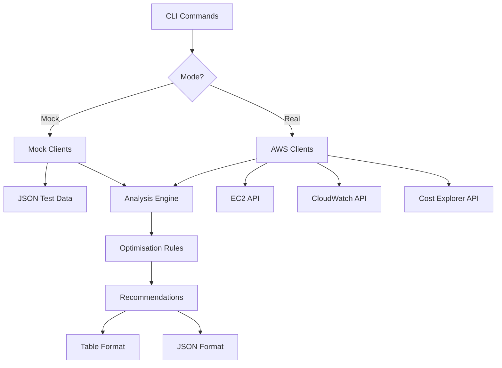

# Cloud Optimiser

<div align="center">


AWS EC2 instance optimisation with real-time cost analysis and right-sizing recommendations.

[Main Features](#main-features) •
[Installation & Setup](#-installation--setup) •
[Usage](#usage) •
[API Documentation](#architecture)

</div>

---

## Project Purpose

### Why I Built This

Although many of these tools exist, I wanted to understand how AWS resources are utilised and identify optimisation opportunities that could significantly reduce cloud spending. Many organisations run EC2 instances that are either oversized (wasting money) or undersized (causing performance issues). This tool provides data-driven recommendations to right-size instances based on actual usage patterns.

### Technical Motivation

I built this project to deepen my understanding of:
- **AWS Service Integration** - Working with EC2, CloudWatch, and Cost Explorer APIs via AWS sdk v2
- **Cost Engineering** - Analysing cloud spending patterns and identifying savings opportunities  
- **CLI Application Design** - Building professional command-line tools with Cobra
- **Mock/Real Data Patterns** - Creating a robust testing framework that doesn't require AWS credentials

### Real-World Application

Although I built this to develop my knowledge and understanding of cloud tools, the architecture has practical applications for:
- **DevOps Teams** - Automated instance right-sizing recommendations
- **Cloud Architects** - Infrastructure efficiency analysis, cost optimisation and budget management
- **Startups** - Reducing cloud bills during rapid scaling
---

## Main Features

- **Real-time Analysis** - Analyses EC2 CPU utilisation via CloudWatch metrics
- **Cost Tracking** - Integrates Cost Explorer data for accurate spend analysis
- **Smart Recommendations** - Suggests instance type changes (upsize/downsize/keep)
- **Dual Mode Operation** - Mock mode (safe testing) and Real AWS mode
- **Flexible Filtering** - Sort by CPU, cost, or savings; filter by state or action
- **Multiple Output Formats** - Table view (human-readable) or JSON

---

## 🛠️ Tech Stack

| Component | Technology |
|-----------|-----------|
| **Language** | Go 1.24+ |
| **CLI Framework** | Cobra |
| **AWS SDK** | aws-sdk-go-v2 |
| **Testing** | Mock data with JSON files |
| **Configuration** | JSON-based config in `~/.cloud-optimiser/` |

---

## Architecture


---

## How It Works

### 1. **Data Collection**
- Lists EC2 instances in your AWS account
- Fetches CPU utilisation metrics (configurable time window)
- Retrieves cost data from Cost Explorer

### 2. **Analysis**
Applies optimisation rules based on thresholds:

| Metric | Threshold | Recommendation |
|--------|-----------|----------------|
| Avg CPU < 20% AND Peak < 40% | Low utilisation | **Downsize** (save ~30%) |
| Avg CPU > 75% | High utilisation | **Upsize** (improve performance) |
| Avg CPU 20-75% | Normal range | **Keep as-is** |
| No metrics | No data | **Review** (potentially stop) |

### 3. **Output**
- Detailed recommendations with reasons
- Estimated monthly savings
- Suggested instance types
- Filterable and sortable results

---

## 📦 Installation & Setup

### Prerequisites
- Go 1.24+
- AWS CLI configured (for real mode only)
- AWS credentials with permissions:
  - `ec2:DescribeInstances`
  - `cloudwatch:GetMetricData`
  - `ce:GetCostAndUsage`

### Quick Start
```bash
# Clone repository
git clone https://github.com/PanaAnt/cloud-optimiser.git
cd cloud-optimiser

# Build the application
go build -o cloud-optimiser

# Set up configuration (creates ~/.cloud-optimiser/config.json)
./cloud-optimiser mode set mock

# Test with mock data
./cloud-optimiser discover --use-mock
```

### AWS Setup (For Real Mode)
```bash
# Configure AWS credentials
aws configure

# Set to real mode
./cloud-optimiser mode set real

# Test connection
./cloud-optimiser discover
```

---

## Usage

### Basic Commands

#### **Discover EC2 Instances**
```bash
# Using mock data (safe, no AWS required)
cloud-optimiser discover --use-mock

# Using real AWS data
cloud-optimiser discover
```

**Output:**
```
MODE: Mock

Discovered EC2 Instances:
 - i-1234567890abcdef0 (t3.micro) [running]
 - i-0987654321fedcba0 (m5.large) [running]
 - i-abcdef1234567890 (t3.small) [stopped]

[Note: Using mock data]
```

#### **Get Optimisation Recommendations**
```bash
# Basic recommendations
cloud-optimiser recommend --use-mock

# With custom time windows
cloud-optimiser recommend --metric-hours 168 --cost-days 90

# Filter and sort
cloud-optimiser recommend --only-downsize --sort savings

# JSON output for automation
cloud-optimiser recommend --output json > recommendations.json
```

**Example Output (Table):**
```
ID                    TYPE      STATE    CPU(avg)  CPU(peak)  COST/mo  ACTION     NEW TYPE   SAVING   REASON
i-1234567890abcdef0   t3.micro  running  8.5%      15.2%     $7.30    Downsize   t3.nano    $2.19   Average CPU 8.5%, peak 15.2%, idle 89% of samples
i-0987654321fedcba0   m5.large  running  82.3%     95.1%     $70.08   Upsize     m5.xlarge  $0.00   Average CPU 82.3% over 24 hours; heavily utilised
i-abcdef1234567890    t3.small  stopped  0.0%      0.0%      $0.00    Review     -          $0.00   No CPU data available; instance stopped
```

### Mode Management
```bash
# Check current mode
cloud-optimiser mode show

# Switch to mock mode (safe testing)
cloud-optimiser mode set mock

# Switch to real AWS mode
cloud-optimiser mode set real
```

### Advanced Usage

#### **Filtering Recommendations**
```bash
# Only show downsize opportunities
cloud-optimiser recommend --only-downsize

# Only show instances needing more resources
cloud-optimiser recommend --only-upsize

# Filter by instance state
cloud-optimiser recommend --state running

# Minimum CPU threshold
cloud-optimiser recommend --min-cpu 50
```

#### **Sorting Results**
```bash
# Sort by CPU utilisation (highest first)
cloud-optimiser recommend --sort cpu

# Sort by monthly cost (highest first)
cloud-optimiser recommend --sort cost

# Sort by potential savings (highest first)
cloud-optimiser recommend --sort savings
```

#### **Using AWS Profiles**
```bash
# Use a specific AWS CLI profile
cloud-optimiser discover --profile production

# With recommendations
cloud-optimiser recommend --profile staging --output json
```

#### **Debug Mode**
```bash
# Enable debug logging
cloud-optimiser --debug recommend --use-mock
```

---

## API Endpoints

While this is a CLI tool, it uses the following AWS APIs internally:

| Service | API Call | Purpose |
|---------|----------|---------|
| **EC2** | `DescribeInstances` | List all instances and their metadata |
| **CloudWatch** | `GetMetricData` | Fetch CPU utilisation metrics |
| **Cost Explorer** | `GetCostAndUsage` | Retrieve cost data per instance |

---

## ⚙️ Configuration

Configuration is stored in `~/.cloud-optimiser/config.json`:
```json
{
  "mode": "mock"
}
```

### Environment Variables

You can override settings with flags:
```bash
# Force mock mode for this run
cloud-optimiser recommend --use-mock

# Use specific AWS profile
cloud-optimiser discover --profile my-profile

# Enable debug output
cloud-optimiser --debug discover
```

---

## Trade-offs

| Design Choice | Benefits | Trade-offs |
|---------------|----------|------------|
| **Mock/Real Separation** | • Safe testing without AWS<br>• No credentials needed for dev<br>• Fast iteration | • Must maintain mock data<br>• Two code paths to test |
| **CLI Architecture (Cobra)** | • Scriptable and automatable<br>• No GUI complexity | • Less accessible for non-technical users<br>• Requires terminal access |
| **Threshold-Based Rules** | • Transparent logic<br>• Easy to explain<br> | • Not ML-based<br>• May miss complex patterns<br>• Fixed thresholds |
| **No Historical Database** | • Stateless operation<br>• Zero persistence overhead<br>• Simple deployment | • Can't track trends<br>• No change history<br>• Requires re-query for updates |

---

### Optimisation Tips

1. **Use Mock Mode** for development and testing
2. **Increase time windows** for more accurate analysis (`--metric-hours 168`)
3. **Filter by region** if you have a multi-region setup (future feature)
4. **Cache results** - save JSON output and process locally

**Note**: Performance will vary based on AWS account size and network conditions.
---

## 📁 Project Structure
```
cloud-optimiser/
├── cmd/
│   ├── discover.go           # EC2 discovery command
│   ├── recommend.go          # Optimisation recommendations
│   ├── root.go               # Root command and flags
│   └── mode/
│       ├── mode.go           # Mode management commands
│       ├── set.go            # Set mode (mock/real)
│       └── show.go           # Show current mode
├── internal/
│   ├── analyser/
│   │   └── ec2_analyser.go   # Optimisation logic
│   ├── awsclient/
│   │   ├── ec2_client.go     # EC2 client factory
│   │   ├── ec2_mock.go       # Mock EC2 client
│   │   ├── ec2_real.go       # Real AWS EC2 client
│   │   ├── cw_client.go      # CloudWatch client factory
│   │   ├── cw_mock.go        # Mock CloudWatch client
│   │   ├── cw_real.go        # Real AWS CloudWatch client
│   │   ├── ce_client.go      # Cost Explorer client factory
│   │   ├── ce_mock.go        # Mock Cost Explorer client
│   │   ├── ce_real.go        # Real AWS Cost Explorer client
│   │   └── aws_checker.go    # AWS credential validation
│   ├── config/
│   │   └── config.go         # Configuration management
│   ├── logging/
│   │   └── logger.go         # Logging utilities
│   └── model/
│       ├── ec2.go            # EC2 instance model
│       ├── metrics.go        # CPU metrics model
│       ├── cost.go           # Cost data model
│       └── recommendation.go # Recommendation model
├── testdata/
│   ├── instance_exmpl.json   # Mock EC2 instances
│   ├── metrics.json          # Mock CloudWatch metrics
│   ├── costs.json            # Mock cost data
│   └── instance_types.json   # Instance type catalog (optional)
├── main.go                   # Application entry point
├── go.mod                    # Go module definition
└── README.md                 # This file
```

---

## ⚠️ Troubleshooting

### AWS Credentials Not Found
```bash
# Check AWS configuration
aws configure list

# Verify credentials
aws sts get-caller-identity

# Try with explicit profile
cloud-optimiser discover --profile default
```

### No Instances Found
```bash
# Check you're in the right region
aws configure get region

# Verify EC2 permissions
aws ec2 describe-instances --max-results 5

# Try mock mode to test the tool
cloud-optimiser discover --use-mock
```

### Permission Denied Errors

Ensure your AWS user/role has these permissions (example):
```json
{
  "Version": "2012-10-17",
  "Statement": [
    {
      "Effect": "Allow",
      "Action": [
        "ec2:DescribeInstances",
        "cloudwatch:GetMetricData",
        "ce:GetCostAndUsage"
      ],
      "Resource": "*"
    }
  ]
}
```

### Cost Data Not Available

Cost Explorer data may not be immediately available:
- New AWS accounts and recent instances: Wait roughly 24 hours and check
- Stopped instances: May show $0 cost (expected)

### Build Errors
```bash
# Update Go modules
go mod tidy

# Clean build cache
go clean -cache

# Rebuild
go build -o cloud-optimiser
```

---

## Potential implementations

### Planned Features
-  **Historical tracking** - Store and compare recommendations over time
-  **Machine learning predictions** - ML-based workload forecasting

---

## Contributing

Contributions are welcome! Please submit an issue first to discuss problems/changes, then pull requests can be made and accepted.

---

## License

MIT License - see [LICENSE](LICENSE) file

---

## Acknowledgments

- [Cobra](https://github.com/spf13/cobra) - CLI framework
- [AWS SDK for Go](https://github.com/aws/aws-sdk-go-v2) - AWS API integration
- [Inspiration from AWS Trusted Advisor](https://aws.amazon.com/premiumsupport/technology/trusted-advisor/)

---

<div align="center">

I hope you found this project useful or interesting!

Project by Panayiotis Antoniou
</div>
